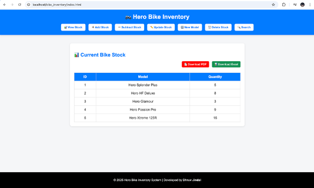
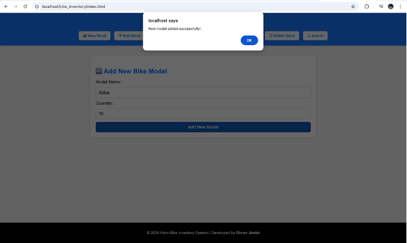

# 🏍️ Hero Bike Inventory System

The **Hero Bike Inventory System** is a web-based application designed to efficiently manage and display information about various Hero bike models. It provides an easy-to-use platform for storing, updating, and viewing inventory details, making it ideal for dealerships or service centers to maintain organized records.

---

## 📋 Table of Contents

- [Overview](#overview)
- [Features](#features)
- [Technologies Used](#technologies-used)
- [Project Structure](#project-structure)
- [Installation and Setup](#installation-and-setup)
- [How to Run the Project](#how-to-run-the-project)
- [Screenshots](#screenshots)
- [Future Enhancements](#future-enhancements)
- [Author](#author)
- [License](#license)

---

## 🧩 Overview

The **Hero Bike Inventory System** simplifies inventory management by automating the process of adding, updating, and deleting bike records. The system uses **HTML, CSS, and JavaScript** for the front end and **MySQL** as the backend database. It provides a user-friendly interface that dynamically displays stored data and allows administrators to maintain an up-to-date list of available Hero bikes.

---
## 🚀 Features

- Add new bike details (model, price, engine capacity, and availability)
- View stored bike data dynamically
- Update or delete existing records
- Search and filter options for easy data access
- Connected to a MySQL database for data persistence
- Responsive web interface with simple navigation

---
## 🛠️ Technologies Used

| Component | Technology              |
| --------- | ----------------------- |
| Frontend  | HTML5, CSS3, JavaScript |
| Backend   | PHP                     |
| Database  | MySQL                   |
| Styling   | Bootstrap (optional)    |
| Server    | XAMPP / WAMP / LAMP     |

---
## 📂 Project Structure


<pre>

Bike-Inventory/
│
├── index.html              # Main homepage
├── add_bike.html           # Page for adding bike details
├── view_bikes.html         # Page to display all bike records
├── style.css               # Custom styling file
├── script.js               # Frontend JavaScript
├── config.php              # Database connection file
├── add_bike.php            # Backend logic for inserting records
├── update_bike.php         # Backend logic for updating records
├── delete_bike.php         # Backend logic for deleting records
└── README.md               # Project documentation
</pre>

---
## ⚙️ Installation and Setup

Follow these steps to run the project locally:

### 1️⃣ Clone the Repository

Open your terminal and run:

```bash
git clone https://github.com/DhruvJDev/Bike-Inventory.git
````

Then move into the project folder:

```bash
cd Bike-Inventory
```

---

### 2️⃣ Set Up the Database

1. Open **phpMyAdmin** (from XAMPP/WAMP/LAMP).
2. Create a new database named:

```
bike_inventory
```

3. Import the SQL file if provided (e.g., `bike_inventory.sql`) into this database.
4. Make sure your `config.php` file includes the correct database credentials:

```php
<?php
$servername = "localhost";
$username = "root";
$password = "";
$database = "bike_inventory";

$conn = mysqli_connect($servername, $username, $password, $database);

if (!$conn) {
    die("Connection failed: " . mysqli_connect_error());
}
?>
```

---

### 3️⃣ Run the Project

1. Copy the project folder (`Bike-Inventory`) into your **XAMPP `htdocs`** directory.
   Example:

   ```
   C:\xampp\htdocs\Bike-Inventory
   ```

2. Start **Apache** and **MySQL** from your XAMPP control panel.

3. Open your web browser and go to:

```
http://localhost/Bike-Inventory/
```

🎉 The Hero Bike Inventory System should now be running successfully!

---
## 🖼️ Screenshots

| Interface                    | Description                         |
| ---------------------------- | ----------------------------------- |
|  | Homepage displaying available bikes |
|   | Form for adding new bike records    |
| ![[update.png]]              | MySQL database storing bike details |

---
## 🔮 Future Enhancements

* Implement user authentication (admin login)
* Add search and filtering functionality
* Generate reports and analytics
* Integrate image uploads for bike models
* Improve UI/UX using frameworks like React or Bootstrap

---
## 👨‍💻 Author

**Dhruv Jindal**
Web Developer | UI/UX Designer | Tech Enthusiast 
📧 Email: [dhruvjindal.dev@gmail.com](mailto:dhruvjindal.dev@gmail.com)
🌐 Portfolio: [https://github.com/DhruvJDev](https://github.com/DhruvJDev)
